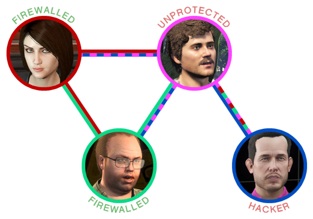
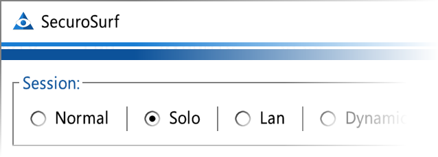
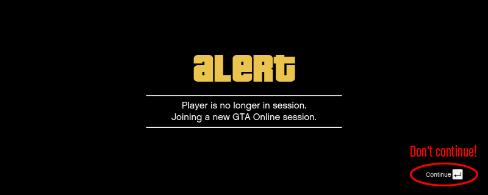

<h1>
    
    SecuroSurf
</h1>

<b>A GTA Online PC Firewall</b>

------------------------------------------------------------------------------------------------------------------------

[**Downloads**](https://github.com/Wes0617/SecuroSurf/releases) 🔹
[User Manual](#user-manual) 🔹
[FAQs](#faqs) 🔹
[TODO](#todo) 🔹
[Credits & Thanks](#credits--thanks)

------------------------------------------------------------------------------------------------------------------------

### 🔹 Is this a mod menu?

No it's not! ___SecuroSurf___ simply blocks traffic from IPs you don't know, which is well within your rights,
especially considering how insecure this game is. _SecuroSurf_ does not decrypt the game's traffic, and it doesn't
interact with the game in any way. It does not contain any reverse-engineered code, nor any code that would violate the
game developer's _EULA_. Furthermore, no decompilation or decryption was necessary to create the program. If all this
doesn't convince you how trivial this program is, consider that the whole thing can be created by anyone with just
[Windows Firewall](https://en.wikipedia.org/wiki/Windows_Firewall), except it would be very cumbersome to use. However,
the usual warning applies because I am not a lawyer… I just want to play in peace: use this at your own risk.

------------------------------------------------------------------------------------------------------------------------

### 🔹 Should I trust this?

You should never trust random code from the internet! However, in this case __the code is open source and free for
anyone to review__. Furthermore, the binaries are built via _GitHub_, whose parent company is _Microsoft_, which should
give you the peace of mind of running safe code.

------------------------------------------------------------------------------------------------------------------------

### 🔹 Is this effective?

As of today (v1.60) it is, but only if used correctly! That is, __all the people you are playing with must use it__.
Otherwise, hackers can still connect through the people that aren't protected by the firewall. How this works
(tunneling) is illustrated by the diagram below; if the _Assistant_ and _Lester_ are running the firewall, but _Rickie_
is not, hackers can connect to _Rickie_, _Lester_ and the _Assistant_ _through_ _Rickie_:  

Will the firewall continue to work in future? It most probably will, because changing the game's network architecture
now, at the end of its life, would be a huge waste of money. GTA Online will continue to be a P2P game, unfortunately.

------------------------------------------------------------------------------------------------------------------------

## User Manual

___SecuroSurf___ is easy to use! The most important functionality is just one click away.

------------------------------------------------------------------------------------------------------------------------

### 🔹 Using the basic functionality of the firewall

The ___Normal___ mode will allow GTA Online traffic without interfering. This is the default at the startup.

The ___Solo___ mode, unsurprisingly, will immediately block all the traffic and take you to a protected empty lobby.

The ___Lan___ mode, instead, will allow only people from your own _Local Area Network_ to connect to your lobbies. This
is useful if you want to play with just your family members, or roommates, etc. Remember that this is only effective if
also the other players are using _SecuroSurf_ with this exact mode enabled.

------------------------------------------------------------------------------------------------------------------------

### 🔹 Using Dynamic sessions (best for most users)

This mode is the best for most players, because it works right out of the box with no configuration necessary. Simply
create a _Solo_ lobby, then switch to _Normal_. Wait a few seconds, and invite your friends (while they are on _Normal_
as well). Once everybody has joined, everybody should enable the ___Dynamic___ mode. This will ensure that only the
people currently in the session will be allowed to stay in the session. In other words, no one else can join after
enabling the _Dynamic_ mode. **Note: this mode is currently not available, but it will be when the version 2.0 of the
app is released.**

------------------------------------------------------------------------------------------------------------------------

### 🔹 Crew sessions (for advanced users and groups)

___Crews___ are totally customizable session configurations. They are the safest mode, given that with them, the
firewall can be kept active all the time, thus offering more protection than the _Dynamic_ session mode, which instead
requires the firewall to be turned off occasionally for your friends to join. Crew sessions are meant for established
groups of people that are looking for a more definitive, stronger solution against frequent attacks from modders. You
can find an example of a crew definition [here](session.crew.Example%20Crew.json_EXAMPLE), and
[here](configs/session_configuration_json_schema.md) the full documentation.

__[Local Crews]__ _Crews_ can be saved in simple _JSON_ files to keep alongside the program's executable. Each member of
the crew should have an identical copy of this file and use it to run the firewall. For example, you can use _Google
Drive_ to distribute the file to all your crew members. The local crew file should be in the same folder as
`SecuroSurf.exe`, and be named `session.crew.name.json`, where "name" can be replaced with any name consisting in ASCII
letters, numbers, and spaces (e.g. `session.crew.My Amazing Crew.json`).

__[Remote Crews]__ Sharing configuration files with your friends can be annoying, so it is possible to host the crew
definitions on the web, and have _SecuroSurf_ fetch them automatically. If your crew provided you with an URL to use 
with _SecuroSurf_, you must create a `session.crews-remote.json` file containing a _JSON_ object whose keys are the crew
names, and the values are the respective URLs you've been given. See an example [here](
configs/session.crews-remote.json_EXAMPLE). The format used for the remote configurations is the same as the local crews, except
the data is obfuscated. If you are the leader of a crew, have a look at the source code to learn how to implement this,
or ask for help in the [issues](./issues) section. 

------------------------------------------------------------------------------------------------------------------------

## FAQs

Frequently Asked Questions.

------------------------------------------------------------------------------------------------------------------------

### 🔹 How to update?

This project follows _SemVer_ versioning. Meaning that, __for example, if you own the firewall version 2.x you can
use your configuration files on any other 2.x, but not 3.x.__. However, you should try to keep your configuration files
updated, rather than blindly copying them from one directory to another. Important to know also, is that the presets
that ship with the firewall (_Normal, Solo, Lan, Dynamic_) are not meant to be user-configurable, so you should always
replace them with the respective newer versions.

------------------------------------------------------------------------------------------------------------------------

### 🔹 Why can't I connect sometimes? (1) 

It is completely normal to get "__Unable to connect to game session__" or "__Player is no longer in session__"
sometimes, even if everything looks fine. These errors happen when you could not complete the connection within the
allowed traffic limits, probably because other people or strangers were trying to connect at the same time. __Should
this happen, don't press _Continue_; open your friends list, and try again by clicking _Join Game___:

------------------------------------------------------------------------------------------------------------------------

### 🔹 Why can't I connect sometimes? (2) 

Instead, if you see a lot of traffic being blocked by the firewall, it means that __you tried to connect to your
friends before the firewall could be updated on their end__ to allow you inside. Unfortunately your connection will be
permanently glitched when this happens, and the only way to fix it is to __switch to single player__ before trying
again. This problem will be solved in a future version, where the app will tell you explicitly when it's ok to join your
friends.

------------------------------------------------------------------------------------------------------------------------

## TODO

_What's cooking? Let me know._

------------------------------------------------------------------------------------------------------------------------

### 🔹 SecuroSurf 2.0

- The remote crews should stop updating themselves if the game is turned off.
- Add timestamps in the telemetry window. And maybe also the transfer rate, etc.
- Implement session lock and Dynamic mode.

------------------------------------------------------------------------------------------------------------------------

### 🔹 SecuroSurf 2.+

- User setting for custom refresh rate (to apply when maximized -- minimized should reduce refresh rate already).
- Custom enable-telemetry setting (always enabled, disabled if minimized, always disabled).
- Notifications, e.g. play bell sound when people join or leave.
- Save settings to local files automatically, such as refresh rate, or window position.
- Add timestamps in the telemetry window. And maybe also the transfer rate, etc.
- Add "please wait N seconds before joining the crew" message.
- Determine whether it is necessary to implement the "mandatory packet detection" heuristics.
- Consider whether to introduce the "Firewall Cooldown" option.
- Implement manual kick of non-firewalled users.
- Allow users to customize the T2 servers.

------------------------------------------------------------------------------------------------------------------------

### 🔹 SecuroSurf >2

- Switch to a better GUI toolkit. Possibly [libui](https://github.com/libui-ng/libui-ng). Any suggestions?
- Maybe port the project to Rust, for performance and for the updated WinDivert bindings.

------------------------------------------------------------------------------------------------------------------------

## Credits & Thanks

This program is inspired by [_Guardian_](https://gitlab.com/digitalarc/guardian), and [_Guardian by Speyedr_](
https://gitlab.com/Speyedr/guardian-fastload-fix). Many thanks to them, as they provided the initial input and info
necessary to start this project. In particular to [_Speyedr_](https://github.com/Speyedr), which figured out the first
proof of concept. Also, thanks to my friend Robert B. for helping me out with _Python_, and many thanks to the guinea
pigs (B. and B.) that helped to test this application.
