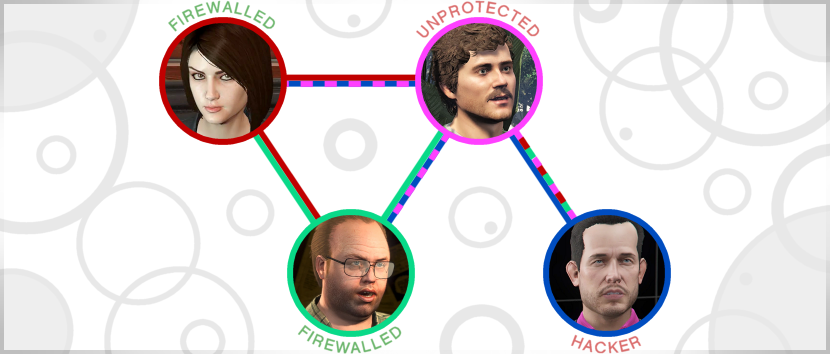
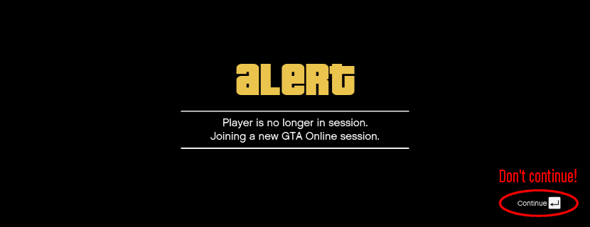

<h1>
    
    SecuroSurf
</h1>

<b>A GTA Online PC Firewall</b>

------------------------------------------------------------------------------------------------------------------------

[User Manual](README.md#user-manual) 🔹
[FAQs](README.md#faqs) 🔹
[TODO](README.md#todo) 🔹
[Credits & Thanks](README.md#todo)

------------------------------------------------------------------------------------------------------------------------

### 🔹 Is this a mod menu?

No it's not! _SecuroSurf_ simply blocks traffic from IPs you don't know, which is well within your rights, especially
considering how vulnerable and poorly maintained this (P2P!) game is. _SecuroSurf_ does not decrypt the game's traffic,
and it doesn't interact with the game in any way. It does not contain any reverse-engineered code, nor any code that
would violate the game developer's _EULA_. Furthermore, no decompilation or decryption was even necessary to create the
program. The traffic is very trivially blocked by just IP and simple heuristics.

### 🔹 Should I trust this?

You should never trust random code from the internet! However, in this case the code is open source and free for anyone
to review. Furthermore, the binaries are built by _GitHub_, whose parent company is _Microsoft_, which should give you
the peace of mind of running safe code.

### 🔹 Is this effective?

Only if used correctly! That is, **all the players you are playing with must use it**. Otherwise, hackers can still
connect through the people that aren't running the firewall. How this works is illustrated by diagram below; if the
_Assistant_ and _Lester_ are running the firewall, but _Rickie_ is not, hackers can connect to _Rickie_, _Lester_ and
the _Assistant_ _**through**_ _Rickie_:  

------------------------------------------------------------------------------------------------------------------------

## User Manual

### 🔹 Using the basic functionality of the firewall

The ___Solo___ option, as you may suspect, will immediately block all the active connections and take you to an empty
protected lobby.

The ___Lan___ option, instead, will allow only people from your own _Local Area Network_ to connect to your lobbies.
This is useful when you want to play with just your family members, or dorm, etc. Remember that this is only effective
if all the clients are using _SecuroSurf_ with this mode enabled.

The ___Normal___ mode will allow GTAO traffic without interfering. This is the default.

### 🔹 Using the Dynamic mode

This mode is the most useful for most players, because it works out of the box with no configuration necessary. Simply
create a _Solo_ lobby, then switch to _Normal_, and invite your friends (while they are on _Normal_ as well). Once
everybody has joined, everybody should enable the ___Dynamic___ mode. This will ensure that only the people in the lobby
will be allowed to stay in the lobby. In other words, no one else can join after enabling the _Dynamic_ mode.

### 🔹 Custom crew definitions

TODO

### 🔹 Local crews

TODO

### 🔹 Remote crews

TODO

------------------------------------------------------------------------------------------------------------------------

## FAQs

### 🔹 How to update?

This project follows _SemVer_ versioning. Meaning that, **for example, if you own the firewall version 2.x you can
use your configuration files on any other 2.x, but not 3.x.**. However, you should try to keep your configuration files
updated, rather than blindly copying them from one directory to another. Important to know also, is that the presets
that ship with the firewall (_Normal, Solo, Lan, Dynamic_) are not meant to be user-configurable, so you should always
replace them with the respective newer versions.

### 🔹 Why can't I connect sometimes (1)? 

It is completely normal to get "**Unable to connect to game session**" or "**Player is no longer in session**"
sometimes, even if everything looks fine. These errors happen when you could not complete the connection within the
allowed traffic limits, probably because other people or strangers were trying to connect at the same time. **Should
this happen, don't press _Continue_; open your friends list, and try again by clicking _Join Game_**:

### 🔹 Why can't I connect sometimes (2)? 

Instead, if you see a lot of traffic being blocked by the firewall, it means that **you tried to connect to your
friends before the firewall could be updated on their end** to allow you inside. Unfortunately your connection will be
permanently glitched when this happens, and the only way to fix it is to **switch to single player** before trying
again. This problem will be solved in a future version, where the app will tell you explicitly when it's ok to join your
friends.

------------------------------------------------------------------------------------------------------------------------

## TODO

## 🔹 SecuroSurf 2.0

- Set up GitHub actions to build releases automatically.
- The remote crews should stop updating themselves if the game is turned off.
- Add timestamps in the telemetry window. And maybe also the transfer rate, etc.
- Implement session lock and Dynamic mode.
- Complete README.

## 🔹 SecuroSurf 2.+

- User setting for custom refresh rate (to apply when maximized -- minimized should reduce refresh rate already).
- Custom enable-telemetry setting (always enabled, disabled if minimized, always disabled).
- Notifications, e.g. play bell sound when people join or leave.
- Save settings to local files automatically, such as refresh rate, or window position.
- Add timestamps in the telemetry window. And maybe also the transfer rate, etc.
- Add "please wait N seconds before joining the crew" message.
- Determine whether it is necessary to implement the "mandatory packet detection" heuristics.
- Consider whether to introduce the "Firewall Cooldown" option.
- Implement manual kick of non-firewalled users. 

## 🔹 SecuroSurf >2

- Switch to a better GUI toolkit. Possibly [libui](https://github.com/libui-ng/libui-ng). Any suggestions?
- Maybe port the project to Rust, for performance and for the updated WinDivert bindings.

------------------------------------------------------------------------------------------------------------------------

## Credits & Thanks

This program was inspired by [_Guardian_](https://gitlab.com/digitalarc/guardian) (and [_Guardian by
Speyedr_](https://gitlab.com/Speyedr/guardian-fastload-fix)). Many thanks to them, as they provided the initial input
and code I needed to start this project. _Guardian_ is still developed, and I try to contribute to it as well. Also
thanks to my friend Robert B. for helping me out with _Python_. 
